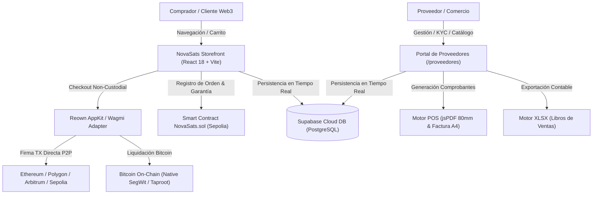

# 🪙 NovaSats — Ecosistema de Comercio Descentralizado Web3 & Pagos On-Chain

[](https://novasats.vercel.app)
[](https://react.dev)
[](https://www.typescriptlang.org)
[](https://vitejs.dev)
[](https://supabase.com)
[](https://cloud.reown.com)
[](https://sepolia.etherscan.io)
[](https://tailwindcss.com)

---

### Metadatos del Repositorio de GitHub

> **Description:**  
> Plataforma de comercio electrónico Web3 y pagos descentralizados en Bitcoin y redes EVM desarrollada en React, TypeScript, Supabase y Reown AppKit con Smart Contracts en Sepolia.
>
> **Website:**  
> `https://novasats.vercel.app`
>
> **Topics:**  
> `bitcoin`, `crypto`, `ecommerce`, `marketplace`, `novasats`, `react`, `smart-contracts`, `supabase`, `typescript`, `vite`, `web3`

---

**NovaSats** es una plataforma de comercio electrónico descentralizado (*Web3 Non-Custodial Marketplace*) de alto rendimiento diseñada para la compra y venta de hardware cripto, billeteras frías, nodos y tecnología blockchain. Permite la liquidación peer-to-peer (P2P) directa a las billeteras de los comercios y proveedores sin intermediarios bancarios ni custodios centralizados.

Cuenta con integración nativa a contratos inteligentes (`NovaSats.sol`), verificación de pagos en Bitcoin (L1) y redes EVM, emisión de comprobantes electrónicos duales homologados (Ticket Térmico POS 80mm y Boleta/Factura Tributaria A4), y un portal integral para proveedores respaldado al 100% en una base de datos relacional de Supabase.

---

## 🏗️ 1. Arquitectura Tecnológica

- **Frontend Core:** React 18, TypeScript, Vite, Tailwind CSS, Lucide React, Canvas Confetti.
- **Web3 & Conectividad Multi-Chain:** `@reown/appkit` y `@reown/appkit-adapter-wagmi` sobre redes Ethereum, Arbitrum, Optimism, Polygon, Base, Sepolia y Bitcoin On-Chain.
- **Capa de Contrato Inteligente:** Smart Contract `NovaSats.sol` desplegado en Sepolia (`0x71C260B543D75aF4D4B12DDe9B1D6F094593C3a9`) para el registro de órdenes, firmas digitales y garantía on-chain de 12 meses.
- **Backend & Base de Datos Relacional:** Supabase (PostgreSQL) con esquemas completos para persistencia sin almacenamiento en caché local.
- **Identidad Generativa:** `@blobatar/react` y `blobatar/expression` para la generación de avatares reactivos y firmas de marca.
- **Motor de Comprobantes & Reportes:** `jspdf` para generación instantánea de tickets térmicos de 80mm y documentos tributarios A4; `xlsx` para la exportación de libros contables en Excel.



---

## 🗄️ 2. Modelo Relacional de Base de Datos (Supabase)

Toda la persistencia de datos del sistema está centralizada en Supabase:

| Tabla | Descripción y Campos Principales |
|---|---|
| `suppliers` | Proveedores registrados, correo, contraseña cifrada, razón social, avatar URL, teléfono, verificación. |
| `products` | Catálogo de productos, SKU, stock, precio USD, descuentos, categoría, estado y multimedia. |
| `orders` | Registro inmutable de transacciones, hash de pago TX, contrato inteligente, total USD/BTC, código de voucher y firma digital. |
| `order_items` | Detalle de artículos comprados por orden (producto, cantidad, precio unitario, subtotal). |
| `supplier_kyc_fiscal` | Información legal para facturación: Razón Social, RUC / Tax ID, País, Domicilio Fiscal, Representante Legal, Documento de Identidad, Resolución Tributaria, Tipo de Comprobante, Teléfono y Correo Fiscal. |
| `supplier_commercial_profiles` | Perfil de marca: Nombre Comercial, Giro / Actividad Económica, Sitio Web, Correo de Soporte, WhatsApp, Redes Sociales (Twitter/X, Telegram, Discord) y Descripción comercial. |
| `supplier_wallets` | Billeteras de recaudación conectadas por el proveedor, red blockchain (`EVM` o `Bitcoin Native`), etiqueta personalizada y bandera de wallet principal. |
| `supplier_voucher_configs` | Configuración de comprobantes permitidos para los compradores (Ticket 80mm / A4 Digital). |
| `product_questions` | Sistema de preguntas de clientes y respuestas de proveedores vinculadas a cada producto. |
| `product_reviews` | Valoraciones con estrellas (1-5), comentarios y testimonios verificados de compradores. |

---

## 🛒 3. Flujo de Compra para Clientes (Storefront)

1. **Catálogo & Búsqueda Avanzada:**
   - Filtros por categorías (Billeteras Frías, Minería ASIC, Seguridad & Seed, Nodos & Hardware, Merchandising, Accesorios).
   - Filtro por rango de precios en USD y satoshis BTC, ofertas y tipos de envío (Gratis / Express 24h).
   - Arrastrar producto (*Drag & Drop*) a pestañas o ventanas transfiriendo el título y enlace limpio.

2. **Ficha del Producto:**
   - Galería interactiva con carrusel y zoom.
   - Especificaciones técnicas, stock en tiempo real y reputación del proveedor con su avatar Blobatar animado.
   - Módulos interactivos de Preguntas & Respuestas y Reseñas con estrellas.
   - Botón para compartir en WhatsApp, Telegram, X (Twitter), Facebook y Correo.

3. **Carrito Flotante & Checkout:**
   - Panel lateral deslizante con cálculo automático del contravalor en satoshis y Bitcoin según el tipo de cambio spot.
   - Conexión rápida con **Reown AppKit** mediante código QR móvil o extensión de navegador (MetaMask, Rabby, Coinbase Wallet, etc.).
   - Selección de billetera pagadora y firma de pago directa hacia la billetera del proveedor.

4. **Comprobante de Pago Criptográfico:**
   - Asignación de Serie POS (`POS-001-...`), Voucher inmutable y Hash de la transacción.
   - Modal con selección de vista previa:
     - **Vista Previa del Voucher 80mm** (Ticket térmico estándar con código de barras y QR).
     - **Vista Previa del A4** (Comprobante tributario oficial timbrado).
   - Acciones directas de **Gmail**, **Imprimir** y descarga de PDF.

---

## 🏢 4. Portal Integral de Proveedores

El portal de proveedores (`/proveedores`) ofrece una suite de administración empresarial:

### 4.1. Mis Productos (`/proveedores/productos`)
- Publicación de nuevos productos con formulario dinámico.
- Ajuste rápido de stock en línea directamente sobre la tabla.
- Activación, suspensión o archivado de publicaciones en 1 clic.

### 4.2. Preguntas de Clientes (`/proveedores/preguntas`)
- Bandeja de preguntas enviadas por los clientes desde las fichas de productos.
- Formulario de respuesta en tiempo real que publica la contestación de inmediato en la tienda.

### 4.3. Calificaciones & Reseñas (`/proveedores/calificaciones`)
- Monitoreo del promedio de satisfacción y desglose de estrellas.
- Respuestas públicas del comercio a las valoraciones de los compradores.

### 4.4. Ventas & Vouchers (`/proveedores/ventas`)
- Historial detallado de pedidos liquidados.
- Visualización y reimpresión de comprobantes oficiales (Ticket 80mm y A4).
- Filtrado por estado, cliente, número de orden o hash TX.

### 4.5. Mi Perfil & Icono (`/proveedores/perfil`)
Consta de 5 módulos principales organizados por pestañas:
1. **Identidad Web3 & Blobatar Pro:**
   - Generación de avatar geométrico reactivo a partir del nombre comercial o semilla criptográfica.
   - 10 expresiones faciales (Radiante, Analítico, Bullish, Decidido, etc.), siluetas y colores de resplandor neón (*Glow*).
   - Modos de animación (*Hover*, *Always*, *Static*).
2. **Billeteras de Cobro:**
   - Conexión vía WalletConnect / Reown AppKit o agregado manual indicando red y etiqueta.
   - Marcador radial de **Billetera Principal de Recaudación** para liquidaciones directas.
3. **Formatos de Voucher:**
   - Activación o desactivación de formatos descargables (80mm y A4) para los clientes.
4. **Verificación & KYC:**
   - **Registro de Información Fiscal y Cumplimiento (KYC):** Razón Social, RUC / Tax ID, País, Domicilio Fiscal, Representante Legal, Documento de Identidad, Resolución Tributaria y Tipo de Comprobante.
   - **Datos Comerciales de la Empresa / Marca:** Nombre Comercial, Giro / Actividad Económica, Sitio Web, WhatsApp, Correos de Soporte y Enlaces a redes sociales.
5. **Zona de Seguridad:**
   - Módulo para **Cambiar Contraseña del Proveedor** con verificación de clave actual y confirmación de seguridad.
   - Auditoría de sesiones y llaves de acceso.

### 4.6. Reportes Analíticos Oficiales
- **Reporte de Ventas (`/proveedores/reportes/ventas`):** Facturación total, ticket promedio, ventas por categoría y exportación a Excel (.xlsx) y PDF.
- **Reporte de Inventario (`/proveedores/reportes/inventario`):** Valoración de inventario, detección de stock bajo y exportación ejecutiva.
- **Reporte de Clientes (`/proveedores/reportes/clientes`):** Listado de compradores con su dirección de wallet, pedidos acumulados y volumen total.

---

## ⚙️ 5. Instalación y Puesta en Marcha

### Requisitos Previos
- **Node.js** >= 18.0.0
- **npm** o **pnpm**

### Variables de Entorno
Crea un archivo `.env` en la raíz del proyecto:

```env
# Conexión Directa a Supabase
VITE_SUPABASE_URL=https://mrshxjdvtnhsjtiiukiq.supabase.co
VITE_SUPABASE_ANON_KEY=tu-anon-key-de-supabase

# Proyecto Reown AppKit / WalletConnect Cloud (https://cloud.reown.com)
VITE_REOWN_PROJECT_ID=tu-reown-project-id

# Smart Contract Oficial en Sepolia Testnet
VITE_NOVASATS_CONTRACT_ADDRESS=0x71C260B543D75aF4D4B12DDe9B1D6F094593C3a9
```

> **Nota para Despliegues en Vercel:** Las variables de entorno en producción deben estar asignadas exclusivamente al entorno **Production**.

### Comandos de Ejecución

```bash
# Instalar dependencias
npm install

# Servidor de desarrollo
npm run dev

# Verificación de tipos y compilación de producción
npm run build

# Vista previa local de la compilación
npm run preview
```

---

## 🛡️ 6. Seguridad y Cumplimiento

- **Transacciones Non-Custodial:** Los compradores transfieren directamente a los vendedores; la plataforma no custodia fondos ni almacena claves privadas.
- **Garantía Digital On-Chain:** Comprobante respaldado por el contrato `NovaSats.sol` que certifica la fecha, monto y participantes.
- **Cumplimiento Tributario:** Comprobantes homologados con campos oficiales de SUNAT / autoridades tributarias locales para facturación electrónica válida.
- **Libro de Reclamaciones:** Módulo integrado para registro formal de quejas y reclamos conforme a normativas de protección al consumidor.

---

## 🌐 Enlaces Oficiales

- **Aplicación Web en Producción:** [https://novasats.vercel.app](https://novasats.vercel.app)
- **Repositorio Oficial en GitHub:** [https://github.com/MiguelCarlosRojas/NovaSats](https://github.com/MiguelCarlosRojas/NovaSats)

---

## 👨‍💻 Autor & Desarrollador Principal

- **Desarrollador:** **Miguel A. Carlos Rojas**
- **GitHub:** [@MiguelCarlosRojas](https://github.com/MiguelCarlosRojas)
- **Portafolio / Web:** [https://miguelcarlos.pages.dev](https://miguelcarlos.pages.dev)
- **Contacto:** [isakiangel6@gmail.com](mailto:isakiangel6@gmail.com)
- **Organización:** Grupo de Inversiones JKL S.A.C.

---

## 📜 Gobernanza, Conducta & Derechos

- [Código de Conducta de la Comunidad (CODE_OF_CONDUCT.md)](./CODE_OF_CONDUCT.md)
- [Aviso de Derechos de Autor y Propiedad Intelectual (COPYRIGHT.md)](./COPYRIGHT.md)
